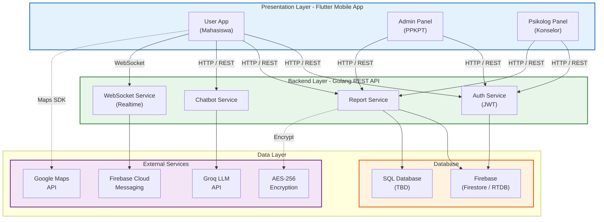
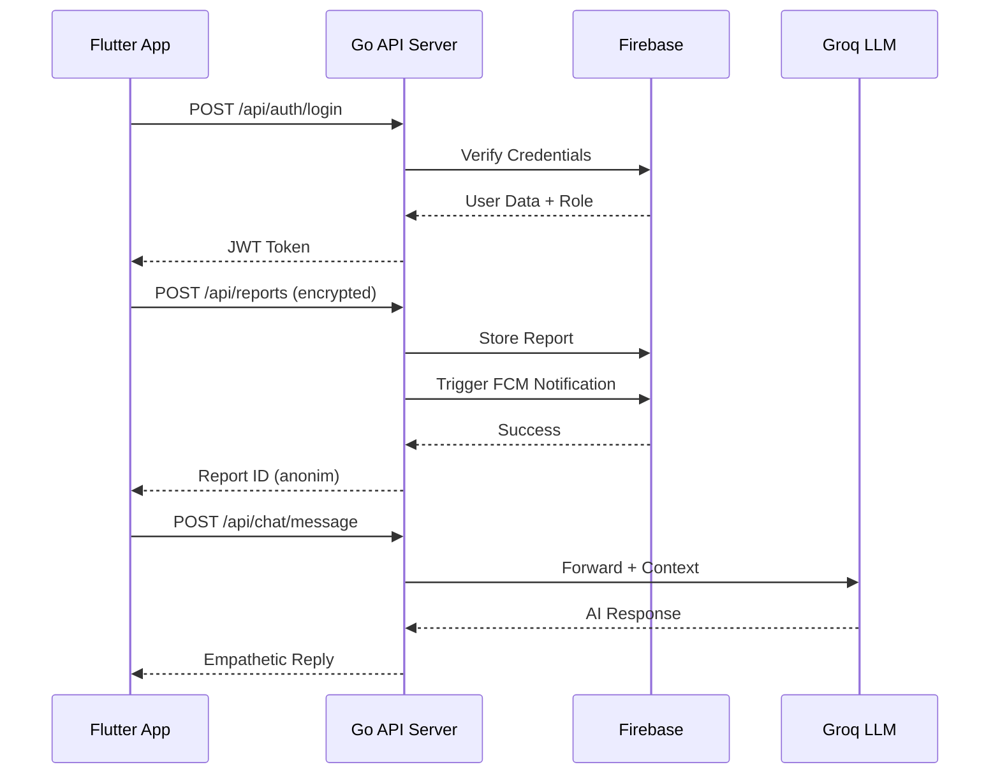
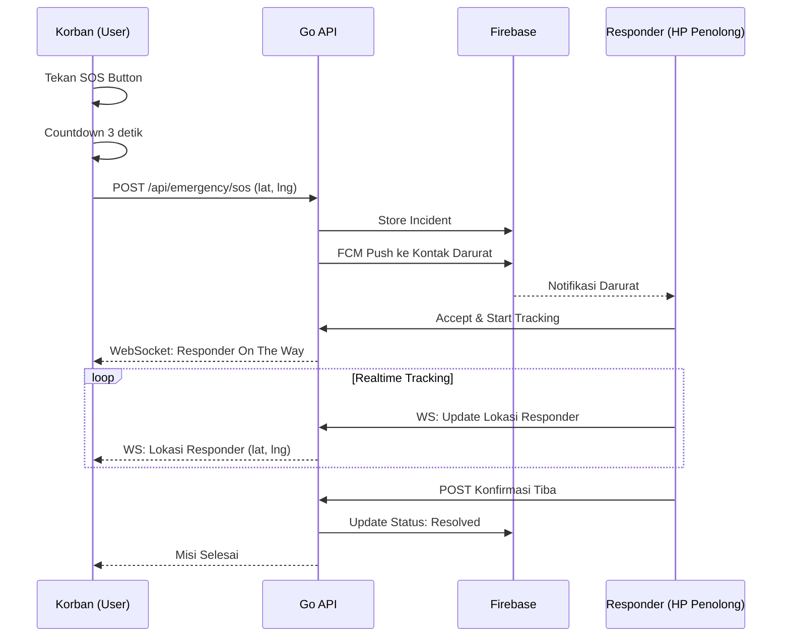

<div align="center">


<p>
  
  
  
  
</p>

> *Platform Mobile Pencegahan dan Penanganan Kekerasan Seksual di Perguruan Tinggi*

**Telkom University Surabaya** | Tahun Akademik 2024/2025

</div>

## Daftar Isi

- [Tentang Proyek](#tentang-proyek)
- [Arsitektur Sistem](#arsitektur-sistem)
- [Fitur Aplikasi](#fitur-aplikasi)
- [Tech Stack](#tech-stack)
- [Struktur Folder](#struktur-folder)
- [Quick Start](#quick-start)
- [API Endpoints](#api-endpoints)
- [Pembagian Tugas](#pembagian-tugas)
- [Tim Pengembang](#tim-pengembang)

## Tentang Proyek

SIGAP PPKPT adalah aplikasi mobile (Android dan iOS) yang menyediakan ekosistem lengkap untuk pencegahan dan penanganan kekerasan seksual di lingkungan kampus. Proyek ini merupakan evolusi dari platform web SIGAP yang bertransformasi ke ekosistem mobile-first dengan stack teknologi baru.

| Komponen | Teknologi |
|----------|-----------|
| Frontend | Flutter (Dart) |
| Backend | Golang (Go) |
| Database | Firebase (Firestore / RTDB) + SQL (TBD) |
| AI | Groq LLM API |

## Arsitektur Sistem

### High-Level Architecture



### Request Flow



### Emergency SOS Flow



## Fitur Aplikasi

### Fitur User (Mahasiswa)

| Modul | Fitur Utama | Jumlah Sub-Fitur |
|-------|-------------|:----------------:|
| 🏠 **Beranda** | Dashboard, Portal Layanan, Agenda Prioritas, Mode Guest | 5 |
| 🛡️ **Lapor Darurat (SOS)** | SOS Button, Countdown, Radar, Live Tracking, FCM Push | 9 |
| 📝 **Lapor Formal** | Form 6 Langkah (Penyintas, Kekhawatiran, Gender, Pelaku, Detail, Data Final), Anonim | 10 |
| 🤖 **Chatbot TemanKu** | Chat AI, Groq LLM, Intent Scoring, Emergency Detection, Consent Flow | 7 |
| 📡 **Pantau Aku** | Check-in Berkala, Background Service, Overlay, Timeout Alert, Kontak Darurat | 10 |
| 📚 **Wawasan** | Artikel Edukasi, Kategori, Search, Featured Article | 8 |
| 👤 **Akun dan Profil** | Edit Profil, Keamanan (PIN, Fingerprint), About, Help, Privacy Policy | 17 |
| 📊 **Pantau Laporan** | Search by Report ID, Timeline Status, Detail View | 3 |
| 🔔 **Notifikasi** | List, Tipe, Mark Read, FCM Integration | 5 |
| 🚀 **Onboarding** | Slides, Auth Check | 3 |

### Fitur Admin Panel

| No | Fitur | Deskripsi |
|----|-------|-----------|
| 1 | Login Admin | Autentikasi role-based via JWT |
| 2 | Dashboard Overview | Statistik total laporan, kasus aktif, resolved |
| 3 | Daftar Kasus | List, filter, search semua kasus |
| 4 | Detail Kasus | View detail dan dekripsi data |
| 5 | Update Status | Diterima, Ditinjau, Proses, Selesai |
| 6 | Manual Input | Input kasus manual |
| 7 | Statistik Visual | Chart dan grafik data kasus |
| 8 | Hapus Kasus | Soft delete dengan konfirmasi |
| 9 | Kelola Artikel | CRUD artikel wawasan / edukasi |
| 10 | Push Notification | Broadcast notifikasi ke user |

### Fitur Psikolog Panel

| No | Fitur | Deskripsi |
|----|-------|-----------|
| 1 | Login Psikolog | Autentikasi khusus psikolog |
| 2 | Dashboard | Overview kasus yang di-assign |
| 3 | Kasus Assigned | List kasus yang ditugaskan |
| 4 | Detail Kasus | Akses data kasus dan histori |
| 5 | Catatan Konseling | Input catatan sesi |
| 6 | Update Progress | Perbarui status penanganan |
| 7 | Jadwal Konseling | Penjadwalan sesi |
| 8 | Chat Langsung | In-app chat dengan user |
| 9 | Rekomendasi Rujukan | Rujukan ke pihak lain |
| 10 | Laporan Penanganan | Export laporan (PDF) |

### Rekap Total

```
User Features  : 77 sub-fitur
Admin Panel    : 10 sub-fitur
Psikolog Panel : 10 sub-fitur
──────────────────────────────
TOTAL          : 97 sub-fitur
```

## Tech Stack

### Frontend

| Teknologi | Fungsi |
|-----------|--------|
| Flutter 3.x | Framework mobile cross-platform |
| Dart 3.x | Bahasa pemrograman |
| Provider | State management |
| Google Maps Flutter | Live tracking peta |
| Google Fonts | Typography |
| HTTP / Dio | REST API client |
| Flutter Overlay Window | Background overlay check-in |
| Permission Handler | Request permissions |
| fl_chart | Visualisasi statistik |

### Backend

| Teknologi | Fungsi |
|-----------|--------|
| Golang (Go) | REST API server |
| Gin / Fiber / Echo | Web framework (TBD) |
| JWT | Token-based authentication |
| gorilla/websocket | Realtime WebSocket |
| Firebase Admin SDK (Go) | Firebase server integration |

### Database dan Services

| Teknologi | Fungsi |
|-----------|--------|
| Firebase Firestore | NoSQL database utama |
| Firebase Realtime DB | Opsional (sync cepat) |
| SQL (TBD) | PostgreSQL / MySQL (jika diperlukan) |
| Firebase Auth | Autentikasi multi-role |
| Firebase Cloud Messaging | Push notification |
| Groq LLM API | AI chatbot engine |
| Google Maps Platform | Maps SDK, Geocoding |
| AES-256-GCM | Enkripsi end-to-end |

## Struktur Folder

```
app/
├── frontend/                          # Flutter Mobile App
│   └── lib/
│       ├── main.dart
│       ├── core/
│       │   ├── constants/
│       │   ├── result/
│       │   └── widgets/
│       └── features/
│           ├── onboarding/            # Splash dan Onboarding
│           ├── app_shell/             # Main Navigation (BottomNav)
│           ├── home/                  # Dashboard Beranda
│           ├── chat/                  # Chatbot AI TemanKu
│           ├── lapor/                 # Lapor Darurat dan Formal
│           ├── pantau/                # Pantau Aku (Check-in)
│           ├── wawasan/               # Edukasi dan Artikel
│           ├── notification/          # Notifikasi
│           ├── report_monitor/        # Pantau Status Laporan
│           ├── account/               # Profil dan Pengaturan
│           ├── admin/                 # Admin Panel (TBD)
│           └── psikolog/              # Psikolog Panel (TBD)
│
├── backend/                           # Golang REST API Server
│   ├── cmd/
│   │   └── server/
│   │       └── main.go
│   ├── internal/
│   │   ├── config/
│   │   ├── middleware/
│   │   ├── handler/
│   │   ├── service/
│   │   ├── repository/
│   │   ├── model/
│   │   └── utils/
│   ├── pkg/
│   ├── go.mod
│   └── go.sum
│
└── docs/                              # Dokumentasi
```

## Quick Start

### Frontend (Flutter)

```bash
cd frontend
flutter pub get
flutter run
```

### Backend (Golang)

```bash
cd backend
go mod download
go run cmd/server/main.go
```

## API Endpoints

### Authentication

| Method | Endpoint | Deskripsi |
|--------|----------|-----------|
| POST | `/api/auth/register` | Registrasi user baru |
| POST | `/api/auth/login` | Login (return JWT dan role) |
| GET | `/api/auth/me` | Get current user info |
| POST | `/api/auth/refresh` | Refresh token |

### Reports

| Method | Endpoint | Deskripsi |
|--------|----------|-----------|
| POST | `/api/reports` | Submit laporan (encrypted) |
| GET | `/api/reports/:id` | Status laporan by ID anonim |
| GET | `/api/reports` | List laporan (Admin only) |
| PUT | `/api/reports/:id/status` | Update status (Admin) |
| DELETE | `/api/reports/:id` | Hapus kasus (Admin) |
| POST | `/api/reports/manual` | Manual input (Admin) |

### Chatbot

| Method | Endpoint | Deskripsi |
|--------|----------|-----------|
| POST | `/api/chat/message` | Kirim pesan ke AI |
| GET | `/api/chat/history` | Histori chat per session |

### Articles

| Method | Endpoint | Deskripsi |
|--------|----------|-----------|
| GET | `/api/articles` | List artikel |
| GET | `/api/articles/:id` | Detail artikel |
| POST | `/api/articles` | Buat artikel (Admin) |
| PUT | `/api/articles/:id` | Edit artikel (Admin) |
| DELETE | `/api/articles/:id` | Hapus artikel (Admin) |

### Psikolog

| Method | Endpoint | Deskripsi |
|--------|----------|-----------|
| GET | `/api/psikolog/cases` | Kasus yang di-assign |
| GET | `/api/psikolog/cases/:id` | Detail kasus |
| POST | `/api/psikolog/cases/:id/notes` | Tambah catatan |
| PUT | `/api/psikolog/cases/:id/progress` | Update progress |
| POST | `/api/psikolog/schedule` | Buat jadwal |
| GET | `/api/psikolog/schedule` | List jadwal |

### Emergency

| Method | Endpoint | Deskripsi |
|--------|----------|-----------|
| POST | `/api/emergency/sos` | Trigger SOS |
| WS | `/ws/tracking/:incident_id` | WebSocket live tracking |

### Statistics dan Notification

| Method | Endpoint | Deskripsi |
|--------|----------|-----------|
| GET | `/api/statistics/dashboard` | Data statistik |
| POST | `/api/notifications/push` | Push notification |

## Pembagian Tugas

| Anggota | Fokus Utama | Fitur |
|---------|-------------|-------|
| **Sulthonika** (Lead) | Arsitektur, Core, Lapor | Go backend setup, Firebase config, seluruh fitur Lapor (Darurat, Formal, Chatbot TemanKu, Pantau Laporan) |
| **Anggota 2** | Admin Panel | ADM-1 s.d. ADM-10 (Flutter + Go API Admin) |
| **Anggota 3** | Psikolog Panel | PSI-1 s.d. PSI-10 (Flutter + Go API Psikolog) |
| **Anggota 4** | Fitur Umum | Beranda, Pantau Aku, Wawasan, Akun, Notifikasi, Onboarding |

## Tim Pengembang

| Nama | NIM | Role |
|------|-----|------|
| Sulthonika Mahfudz Al Mujahidin | 1202230023 | Project Lead, Full-Stack Developer |
| Anggota 2 | - | Developer |
| Anggota 3 | - | Developer |
| Anggota 4 | - | Developer |

**Dosen Pembimbing:** Mustafa Kamal, S.Kom., M.Kom

## Lisensi

MIT License - Copyright (c) 2024-2025 SIGAP Development Team, Telkom University Surabaya

<div align="center">


**SIGAP PPKPT Mobile** | Flutter + Golang + Firebase  
Telkom University Surabaya | 2024-2025

</div>